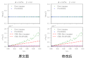
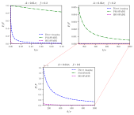

# HG-SPADE

## HG-SPADE 的一些基本结论

测量得到的结果: 
$$
p(q) = \frac{e^{-\eta}\eta^q}{q!}\qq{where}\eta:=\frac{s^2}{4\sigma^2}
$$
对 $s$ 的导数: 
$$
\dv s p(q) 
= \frac1{\sigma}\frac{e^{-\eta}}{q!} \eta^{q-\frac12}(q - \eta)
$$
令 $\gamma = \sum_q \gamma_q$, 得到
$$
\sigma^2\gamma_q = \frac{e^{-2\eta}}{q!(e^{-\eta}\eta^q+q!b')} \eta^{2q-1}(q - \eta)^2\qq{where} b':=\frac{b}{\nu}
$$

## HG-SPADE 的 $\gamma$

当 $s=0$ 的时候, HG-SAPDE 处于最差抗噪性状态, 此时即便是再微小的噪声都将完全破坏 HG-SPADE. 在数值上体现出 $\gamma \approx 0$. 这是由于当 $s=0$ 时, 所有的关于 $s$ 的 CFI 均包含在 $\phi_1$ 模式之上, 而此时 $\phi_1$ 模式上的光子数期望为 0, 因此抗噪性也为 0. 仅当 $b$ 严格等于 0 时 $\gamma = 1$. 

该结论可以由 (3) 式看出, 代入 $\eta = 0$ 后, 当 $b\neq0$ 时, (3) 式中的第一项分式是有限大小的. 此时将导致对于所有的 $q$ 均有 $\sigma^2\gamma_q = 0$. 当 $b=0$ 时, $\sigma^2\gamma_1 = 1$.

正是由于这个特性, 导致在数值上计算出现一些问题. 这是由于在数值上令 $b,\eta=0$ 会导致除零错误. 对于 DI 和 PM-SPADE, 之前采用 $b=10^{-10}$ 平滑, 保证数值稳定性, 因为如此小的噪声不会对 PM-SPADE 和 DI 造成影响. 而 HG-SPADE 的问题就在于即便是采用 $b=10^{-10}$, 也会完全破坏 HG-SPADE.

## 一处修改

点光源的运动范围实际上是 0 到 $2A$, 也就是说点光源的实际运动方程为 (近似为正弦波)
$$
s(n,f) = A\sin(2\pi f n) +A
$$
相当于对原波形的做一个偏置. 但实际上由于偏置不会影响求导, 所以在无噪声的情况下不会影响 QFI 的取值. 而且在无噪声的情况下, HG-SPADE 是全模式的 SPADE, 和平移后的点光源也不会对 CFI 造成影响. 只有 PM-SPADE 由于平移的不对称性 (小 $s$ 的情况 CFI 大), 会对 CFI 的取值造成影响. 不过实际上由于 $s=-A$ 时的 CFI 更小, 一来一回会大致抵消掉影响, 所以在之前的文章中并没有考虑. 下图为原文图和添加偏置后的图, 可以看到感官上影响不大.

但是, 由于 HG-SPADE 的特性, 在 $s$ 不同时的抗噪性不一样. 所以在有噪声的情况下, 考虑偏置或不考虑偏置会造成明显的影响. 而且, 由于 HG-SPADE 无法区分位移的方向, 如果考虑 $-A$ 到 $A$ 的运动会导致观测数据的频率翻倍, 振幅减半. 所以需要换回考虑这个有偏置的情况. 

## HG-SPADE 的 CFI

当 $s$ 比较小但不为 0 时, HG-SPADE 才能体现出一定的抗噪性. 比如我们如果关心频率 $f$ 的 CFI, 此时, 由于点光源是运动的, 所以 $s$ 不会时时刻刻为 0. 下图展示了 $b$ 比较小 (和原文图范围一样, 实际上也不小了) 和 $b$ 比较大的两种情况. 其中 $y$ 轴取了和 CFI 和 QFI 的比值.

可以看到, 在 $s$ 不严格为零时, 实际上 HG-SPADE 仍然有抗噪性. 但是这个优势会随着 $s$ 的缩小而变小. 特别是当 $s=0$ 时, HG-SPADE 的抗噪性处于最差状态, 任意小的噪声都会完全破坏 HG-SPADE (详见 2 节).

