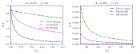
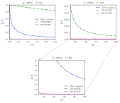
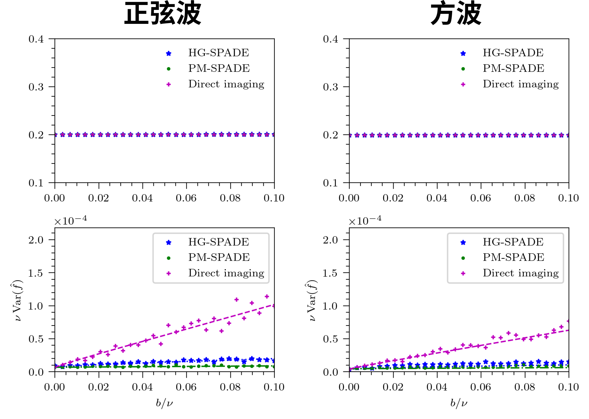
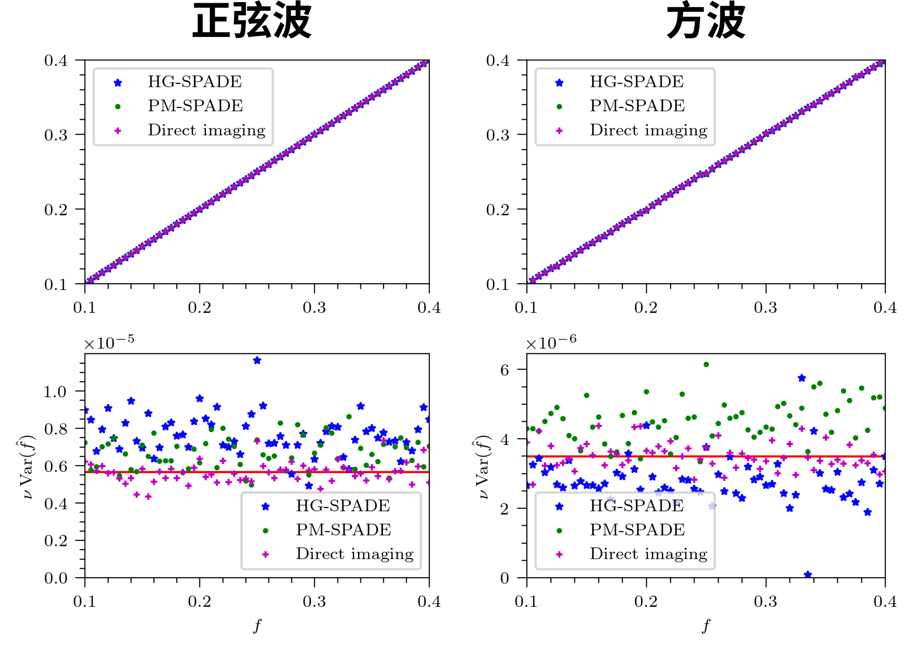

# HG-SPADE 和 threshold

## HG-SPADE 的一些基本结论

测量得到的结果: 
$$
\mu_q = \frac{e^{-\eta}\eta^q}{q!}\qq{where}\eta:=\frac{s^2}{4\sigma^2}
$$
对 $s$ 的导数: 
$$
\pdv{\mu_q}{s} 
= \frac1{\sigma}\frac{e^{-\eta}}{q!} \eta^{q-\frac12}(q - \eta)
$$
令 $\gamma = \sum_q \gamma_q$, 得到
$$
\sigma^2\gamma_q = \frac{e^{-2\eta}}{q!(e^{-\eta}\eta^q+q!b')} \eta^{2q-1}(q - \eta)^2\qq{where} b':=\frac{b}{\nu}
$$

## HG-SPADE 的 $\gamma$

当 $s=0$ 的时候, HG-SAPDE 处于最差抗噪性状态, 此时即便是再微小的噪声都将完全破坏 HG-SPADE. 在数值上体现出 $\gamma \approx 0$. 这是由于当 $s=0$ 时, 所有的关于 $s$ 的 CFI 均包含在 $\phi_1$ 模式之上, 而此时 $\phi_1$ 模式上的光子数期望为 0, 因此抗噪性也为 0. 仅当 $b$ 严格等于 0 时 $\gamma = 1$. 

该结论可以由 (3) 式看出, 代入 $\eta = 0$ 后, 当 $b\neq0$ 时, (3) 式中的第一项分式是有限大小的. 此时将导致对于所有的 $q$ 均有 $\sigma^2\gamma_q = 0$. 当 $b=0$ 时, $\sigma^2\gamma_1 = 1$.

正是由于这个特性, 导致在数值上计算出现一些问题. 这是由于在数值上令 $b,\eta=0$ 会导致除零错误. 对于 DI 和 PM-SPADE, 之前采用 $b=10^{-10}$ 平滑, 保证数值稳定性, 因为如此小的噪声不会对 PM-SPADE 和 DI 造成影响. 而 HG-SPADE 的问题就在于, 如果 $s$ 极小, 甚至为 0 时, 即便是采用 $b=10^{-10}$, 也会完全破坏 HG-SPADE.

## 一处修改

点光源的运动范围实际上是 0 到 $2A$, 也就是说点光源的实际运动方程为 (近似为正弦波)
$$
s(n,f) = A\sin(2\pi f n) +A
$$
相当于对原波形的做一个偏置. 但实际上由于偏置不会影响求导, 所以在无噪声的情况下不会影响 FI 的取值. 而且在无噪声的情况下, HG-SPADE 是全模式的 SPADE, 和平移后的点光源也不会对 CFI 造成影响. 只有 PM-SPADE 由于平移的不对称性 (小 $s$ 的情况 CFI 大), 会对 CFI 的取值造成影响. 不过实际上由于 $s=-A$ 时的 CFI 更小, 一来一回会大致抵消掉影响, 所以在之前的文章中并没有考虑. 下图为原文图和添加偏置后的图, 可以看到感官上影响不大.

但是, 由于 HG-SPADE 的特性, 在 $s$ 不同时的抗噪性不一样. 所以在有噪声的情况下, 考虑偏置或不考虑偏置会造成明显的影响. 而且, 由于 HG-SPADE 无法区分位移的方向, 如果考虑 $-A$ 到 $A$ 的运动会导致观测数据的频率翻倍, 振幅减半. 所以需要换回考虑这个有偏置的情况. 

## HG-SPADE 的 CFI

**数值计算的 CFI 曲线**

当 $s$ 比较小但不为 0 时, HG-SPADE 才能体现出一定的抗噪性. 比如我们如果关心频率 $f$ 的 CFI, 此时, 由于点光源是运动的, 所以 $s$ 不会时时刻刻为 0. 下图展示了 $b$ 比较小 (和原文图范围一样, 实际上也不小了) 和 $b$ 比较大的两种情况. 其中 $y$ 轴取了和 CFI 和 QFI 的比值.

可以看到, 在 $s$ 不严格为零时, 实际上 HG-SPADE 仍然有抗噪性. 但是这个优势会随着 $s$ 的缩小而变小. 特别是当 $s=0$ 时, HG-SPADE 的抗噪性处于最差状态, 任意小的噪声都会完全破坏 HG-SPADE (详见 2 节).

**理论分析**

我们要考虑随着噪声的增加, PM-SPADE 是否有 threshold. 因此, 我们考虑噪声主导极限. 在该条件下, $b$ 是一个比较大的量, 从而满足 $\mu_j +b'\approx b'$. 此时
$$
\gamma \approx \frac1{b'}\sum_q \qty(\pdv{\mu_q}{s})^2
$$
在这种条件下, 我们有 (求和 Mathematica 可以计算)
$$
\sigma^2\gamma^\text{(HG)}=\frac1{b'}\sum_q\frac{\eta^{2q-1}}{(q!)^2}\qty(q-\eta)^2e^{-2\eta} = \frac{2 \eta}{b'}  \qty[I_0(2 \eta)-I_1(2 \eta)]e^{-2\eta}
$$
其中 $I$ 表示第一类虚宗量贝塞尔函数. 而对于 PM-SAPDE, 则有
$$
\sigma^2\gamma^\text{(PM)} = \frac{1}{4b'}\qty(3 \eta^3+6 \eta^2-7 \eta+2) e^{-2 \eta}
$$
如果假设 $s$ 的值域比较小 (类似上节 $A=0.01\sigma$ 情况), 可以得到
$$
\boxed{\sigma^2\gamma^\text{(HG)}\approx 0;\quad\sigma^2\gamma^\text{(PM)}\approx \frac1{2b'}}
$$
接下去考虑 DI, 有
$$
\sigma^2\gamma^\text{(DI)}\approx\frac{1}{2\pi b'}\sum_k\qty(-e^{-z_+^2}+e^{-z_-^2})^2\qq{where} z_\pm = \frac{ak-\theta \pm a/2}{\sqrt{2}\sigma}
$$
由于 $k$ 表示第 $k$ 个像素, 其求和范围是从 $-\infty$ 到 $\infty$. 同时如果像素尺寸足够小, 这个求和就可以近似为积分. 有
$$
\sum_k\qty(-e^{-z_+^2}+e^{-z_-^2})^2\approx\int^{\infty}_{-\infty}(-e^{-z_+^2}+e^{-z_-^2})^2\dd{k} = {2\sigma'\sqrt{\pi } \qty(1-e^{-\frac{1}{4 \sigma^{\prime 2}}})}
$$
其中 $\sigma':={\sigma}/{a}$. 由于我们假设像素尺寸足够小, 所以 $1/(4\sigma')$ 是个小量, 所以有
$$
1-{e^{-\frac{1}{4 \sigma^{\prime 2}}}}\approx\frac{1}{4\sigma^{\prime 2}}
$$
最终得到
$$
\boxed{\sigma^2\gamma^\text{(DI)}\approx\frac{1}{4\sqrt\pi\sigma' b'}}
$$
可以看到, 虽然他们都会随着 $b'$ 增大而逐渐趋于 0, 但是由于它们趋于零的速度不一样快, 所以可以计算比值
$$
\frac{F^\text{(DI)}}{F^\text{(PM)}}=\frac{\gamma^\text{(DI)}}{\gamma^\text{(HG)}}\frac{\sum_n\cdots}{\sum_n\cdots}=\frac a{2\sqrt{\pi}\sigma}
$$
因此可以说, 在位移范围不大的情况下, PM-SPADE 并不会随着噪声的增加而出现 threshold.

## HG-SPADE 模拟

模拟使用的参数和实验一致, 结果如下:

其中, $A = 0.47\sigma, f=0.2$, 没有考虑随机延迟, 点光源运动范围为 $-0.01\sigma$ 至 $-0.94\sigma$ (为了和实验符合). 在负的位移情况下, HG-SPADE 只能返回正的估计值. 而 PM 模式是对称的, DI 则满足平移不变性, PM-SPADE 和 DI 的位移均标为正. 

或者说, 这是正方向的选取问题, 在实验中, DI 被视作基准, 点光源的坐标 $y$ 值增加的方向被定义为了正方向, 这比较符合直观. 但是由于一般相机的坐标零点为左上角, 在该定义下, 点光源向上运动的方向被定义为为负方向. 实际实验操作过程中, 由于习惯问题, 从而导致了位移方向选取为负的的问题.

可以看到, 模拟的结果和理论预期符合非常好, 而 HG-SPADE 比 PM-SPADE 抗噪性略差. 然后是无噪声的情况:

在这里同样没有引入随机延迟, 所以不存在异常升高的问题. 但是可以看到, 方波的模拟结果比 CRB 略低一点, 换成正弦波则比 CRB 稍微高一点点, 这可能是由于 HG-SPADE 在 $s$ 比较小的时候的奇异问题导致的. 
